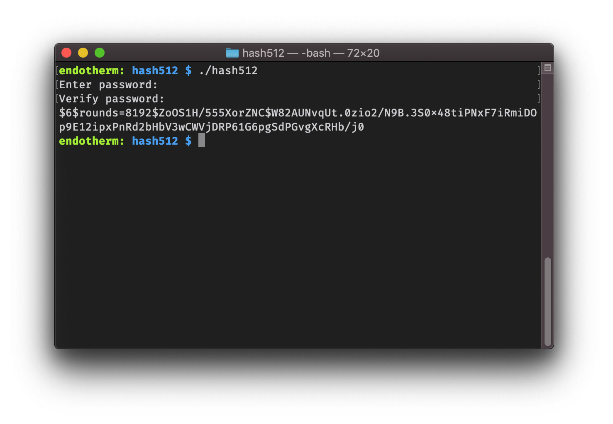

# hash512

_A tiny CLI utility for making SHA-512 password hashes._

[![Go Report Card][grc-img]][grc]

## Installation

- **Manually:** Check out the
  [releases](https://github.com/steven-xie/hash512/releases) for downloads.
- **Using `go get`**:

  ```bash
  go get -u github.com/steven-xie/hash512
  ```

## Usage

See `./hash512 --help` for full usage documentation.

```bash
./hash512 -r <rounds> # rounds is related to hash security, defaults to 8192
## Input: The password to hash (x2, once for verification).
## Output: The resulting hash.
```

## Motivation

I was generating password hashes for use with
[CoreOS Ignition](https://coreos.com/os/docs/latest/adding-users.html), when
I realized that the `mkpasswd` utility they suggested for making user account
password hashes only available on a few Linux distributions. I wanted a better,
cross-platform solution for making user password hashes that I could run on my
macOS development machine, without the need for a Linux VM.

So I made one.

<p align="center"></p>

[grc]: https://goreportcard.com/report/github.com/steven-xie/hash512
[grc-img]: https://goreportcard.com/badge/github.com/steven-xie/hash512
